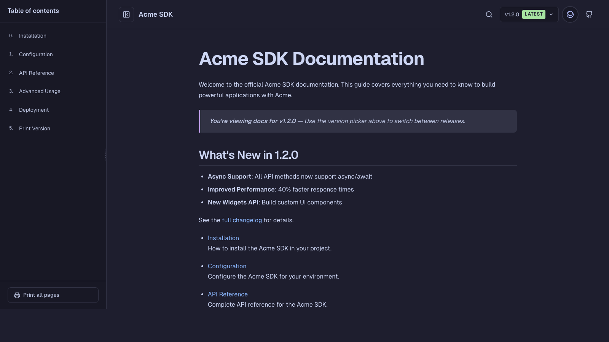

# Tanuki (タヌキ)

A versatile, whimsical Zola theme with Catppuccin colors, Geist typography, and Nintendo-inspired UX. Named after the playful Japanese raccoon dog.



## Features

- **Three Modes**: Documentation, E-book, and Site/Blog
- **Catppuccin Colors**: Mocha (dark) and Latte (light) themes
- **Geist Typography**: Beautiful, readable fonts
- **Lucide Icons**: Clean, consistent iconography
- **Nintendo-inspired UX**: Whimsical animations and obvious interactions
- **Full-text Search**: Elasticlunr-powered search
- **Print Support**: Print all pages as a single document
- **Responsive**: Works beautifully on all devices
- **Accessible**: WCAG-compliant with keyboard navigation

## Installation

### As a Git Submodule (Recommended)

```bash
cd your-zola-site
git submodule add https://github.com/raskell-io/tanuki themes/tanuki
```

### Manual Installation

Download and extract the theme to your `themes/tanuki` directory.

## Configuration

Add to your `config.toml`:

```toml
theme = "tanuki"

[extra]
# Theme mode: "docs" | "book" | "site"
mode = "site"

# Author name
author = "Your Name"

# GitHub repository URL
github = "https://github.com/yourusername/yourrepo"

# Theme settings
default_theme = "auto"  # "light" | "dark" | "auto"
show_theme_toggle = true

# Navigation links
nav_links = [
    { name = "Home", url = "/" },
    { name = "Blog", url = "/blog" },
    { name = "About", url = "/about" },
]
```

## Modes

### Documentation Mode (`mode = "docs"`)

Perfect for technical documentation with versioning support.

```toml
[extra]
mode = "docs"

[extra.docs]
versioned = true
current_version = "1.0"
versions = [
    { version = "1.0", path = "/docs/1.0", latest = true },
    { version = "0.9", path = "/docs/0.9", latest = false },
]
```

Features:
- Sidebar with table of contents
- Version picker dropdown
- Prev/Next navigation buttons
- Print all pages
- Keyboard navigation (arrow keys)

### E-book Mode (`mode = "book"`)

Ideal for online books and guides.

```toml
[extra]
mode = "book"

[extra.book]
show_landing = true
show_toc = true
```

Features:
- Chapter navigation
- Reading-optimized layout
- Print functionality
- No versioning overhead

### Site/Blog Mode (`mode = "site"`)

For personal sites, blogs, and landing pages.

```toml
[extra]
mode = "site"

[extra.site]
show_hero = true
posts_per_page = 10

# Call-to-action buttons
cta_primary = { text = "Get Started", url = "/docs" }
cta_secondary = { text = "Learn More", url = "/about" }
```

Features:
- Hero section
- Blog post cards
- Tag support
- Pagination

## Customization

### Colors

The theme uses Catppuccin color palettes. Override CSS variables in your own stylesheet:

```css
:root {
  --color-accent: var(--ctp-pink);  /* Change accent color */
}
```

### Fonts

To use different fonts, override in your `config.toml`:

```toml
[extra]
custom_fonts = true
```

Then add your own `@font-face` declarations.

## Keyboard Shortcuts

| Key | Action |
|-----|--------|
| `ArrowLeft` | Previous page (docs/book mode) |
| `ArrowRight` | Next page (docs/book mode) |
| `/` | Open search |
| `Esc` | Close search/sidebar |

## Browser Support

- Chrome/Edge 88+
- Firefox 78+
- Safari 14+

## Contributing

Contributions are welcome! Please read our [Contributing Guide](CONTRIBUTING.md).

## License

MIT License - see [LICENSE](LICENSE)

## Credits

- [Catppuccin](https://github.com/catppuccin/catppuccin) - Color palette
- [Geist](https://vercel.com/font) - Typography
- [Lucide](https://lucide.dev) - Icons
- [Zola](https://www.getzola.org) - Static site generator

---

Made with love by [raskell.io](https://raskell.io)
